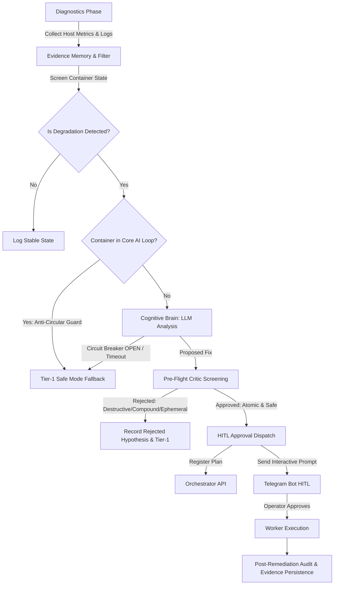

# auto-healing-agent

[](https://github.com/restrok/auto-healing-agent/actions/workflows/ci.yml)
[](https://www.python.org/)
[](https://opensource.org/licenses/MIT)
[](https://github.com/astral-sh/ruff)

Autonomous homelab auto-healing and infrastructure resilience agent featuring Human-In-The-Loop (HITL) approval, LLM-assisted root-cause diagnosis, pre-flight regularizing critic, and post-remediation audit verification.

Inspired by **RRSI** (*Regularized Recursive Self-Improvement* - [arXiv:2609.24972](https://arxiv.org/abs/2609.24972)), the agent adheres to strict safety invariants: update sparsity (max 1 mutation per cycle), anti-circular dependency circuit breaking, deterministic bootstrap recovery order, and ephemeral ID / volatile path leakage screening.

---

## 🏛️ Architecture



### Key Safety Mechanisms
1. **Tier-1 Deterministic Bootstrap Order**: Enforces an explicit recovery order (`docker.service` → database → LLM engine → brain → scheduler → individual applications) avoiding circular dependencies on AI infrastructure.
2. **Circuit Breaker State Machine**: Monitors remote LLM endpoints; transitions `CLOSED` → `OPEN` → `HALF_OPEN` with fast-fail timeouts to prevent stalled execution.
3. **Pre-Flight Critic (RRSI Regularization)**:
   - `EPHEMERAL_ID`: Blocks proposals containing 12-char or 64-char transient container IDs.
   - `VOLATILE_PATH`: Blocks actions relying on `/tmp`, `/var/tmp`, `/dev/shm`.
   - `DESTRUCTIVE_COMMAND`: Prevents `rm -rf`, raw disk operations, `docker system prune`, or host shutdowns.
   - `NON_ATOMIC` (Update Sparsity): Restricts updates to a single atomic command per cycle (rejecting `&&`, `;`, `||`, `|`).
4. **Evidence Memory**: Preserves audit outcomes and rejected hypotheses in SQLite across cycles with a sliding exclusion window.

---

## 📋 Human-In-The-Loop (HITL) Contract

When cognitive analysis produces a valid remediation proposal for anomalous log errors, the agent registers a pending plan with the Agent Orchestrator and dispatches an interactive Telegram inline keyboard:

### API Request Schema (`POST /api/plans`)
```json
{
  "plan_id": "heal_ab12cd34",
  "requester_id": "auto-healer",
  "requester_telegram_id": "123456789",
  "title": "Auto-Healing: Fix database connection pool",
  "plan_details": "Diagnóstico automático de Auto-Healing...\n• Causa Raíz: Connection timeout...\n• Fix Sugerido: restart container...",
  "task": "docker restart core-db-1",
  "target_project": "core-services"
}
```

### Operator Interaction
The Telegram notification includes inline action buttons:
- `✅ Aprobar y Ejecutar Worker`: Dispatches the approved task to the autonomous execution worker.
- `❌ Rechazar`: Syncs rejection to SQLite evidence memory, permanently marking the hypothesis as discarded for future cycles.

---

## ⚙️ Configuration & Environment Variables

Copy `.env.example` to `.env` and configure your credentials:

```bash
cp .env.example .env
```

| Variable | Required | Default | Description |
| :--- | :---: | :---: | :--- |
| `TELEGRAM_BOT_TOKEN` | Yes (for `--notify`) | *None* | Telegram Bot API Token for digests and HITL prompts |
| `TELEGRAM_CHAT_ID` | Yes (for `--notify`) | *None* | Telegram chat/user ID for authorized operator alerts |
| `OLLAMA_BASE_URL` | Optional | `https://ollama.com/v1` | OpenAI-compatible endpoint for LLM anomaly diagnosis |
| `OLLAMA_API_KEY` | Optional | *None* | Bearer authentication key for remote LLM inference |
| `LLM_MODEL` | Optional | `deepseek-v4.1-flash` | Model identifier for root cause analysis |
| `LLM_CALL_TIMEOUT` | Optional | `45.0` | Maximum call timeout in seconds for cognitive LLM inference calls |
| `CIRCUIT_BREAKER_RECOVERY_TIMEOUT` | Optional | `60.0` | Cooldown period in seconds before circuit breaker transitions OPEN to HALF_OPEN |
| `ORCHESTRATOR_API_URL` | Optional | `http://localhost:8001` | Base URL of the Agent Orchestrator API for HITL plans |
| `ORCHESTRATOR_DB_PATH` | Optional | `./data/orchestrator.db` | Path to orchestrator SQLite database for rejection sync |
| `REQUESTER_ID` | Optional | `auto-healer` | Requester identification string for registered plans |
| `HEALING_DB_PATH` | Optional | `./healing_history.sqlite` | SQLite database file storing run history and evidence memory (legacy `HEAL_DB_PATH` supported) |
| `HEAL_DISK_WARN` | Optional | `75.0` | Disk usage percentage threshold for warnings |
| `HEAL_DISK_CRIT` | Optional | `85.0` | Disk usage percentage threshold for critical alerts |
| `HEAL_MEM_MIN_MB` | Optional | `1500.0` | Minimum available RAM in MB before raising an alert |
| `HEAL_SWAP_MAX_MB` | Optional | `4000.0` | Maximum swap usage in MB before raising an alert |
| `HEAL_MAX_REMEDIATIONS` | Optional | `2` | Maximum mutations permitted per run |
| `HEAL_COOLDOWN_SEC` | Optional | `20` | Cooldown period between successive container remediations |
| `HEAL_LOG_SCAN_HOURS` | Optional | `24` | Rolling window (in hours) to scan container error logs |

---

## 🚀 Usage

### Command-Line Execution
Run diagnostics and auto-healing directly:

```bash
# Dry run without modifying containers or host state
python -m auto_healing.healer --dry-run

# Standard execution with Telegram digest notification
python -m auto_healing.healer --notify

# Force cleanup of dangling Docker images
python -m auto_healing.healer --force-prune
```

### Automated Batch Execution
A helper wrapper script `run_healing.sh` is provided for scheduling via cron or systemd timers:

```bash
./run_healing.sh
```

Example cron job (`/etc/cron.d/auto-healing`):
```cron
# Run auto-healing every day at 07:00 UTC
0 7 * * * root /path/to/auto-healing-agent/run_healing.sh
```

> [!NOTE]
> **Deployment Mode Note**: Because `auto-healing-agent` operates as a scheduled batch maintenance job inspecting host systemd units and interacting with the local Docker daemon via `/var/run/docker.sock`, running it natively on the host via virtualenv or systemd timer is recommended over containerization.

---

## 🧪 Testing and Quality Assurance

The codebase includes an exhaustive test suite covering circuit breaker dynamics, pre-flight regularizing critic rules, SQLite schema migrations, and end-to-end resilience workflows.

### Running Tests
```bash
# Run pytest with code coverage
uv run pytest --cov=auto_healing --cov-report=term-missing tests/
```

### Running Linting & Code Formatting
```bash
# Check lint rules
uv run ruff check .

# Check formatting
uv run ruff format --check .

# Auto-format
uv run ruff format .
```

---

## 📄 License

This project is licensed under the [MIT License](LICENSE).
